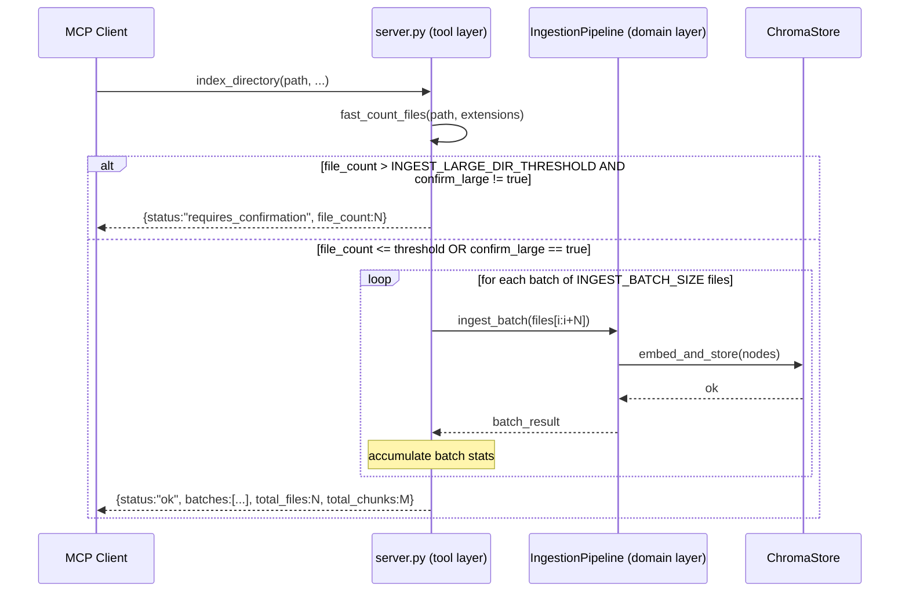

# ADR-BIN-001: Batch Directory Ingestion Strategy

## Status
Accepted

## Context
`IngestionPipeline.ingest_directory()` currently performs a monolithic scan: it discovers
all matching files, parses them all, builds all nodes, embeds everything, and stores in one
single operation. For large codebases (observed: XplorerEditor, 100K+ lines of C#) this
causes a 400 context-length error from the MCP server before any data reaches ChromaDB.

Three architectural choices are required:
1. Where does batching live — tool layer (`server.py`) or domain layer (`IngestionPipeline`)?
2. How does the MCP protocol handle the large-directory confirmation (MCP is request-response only)?
3. Where do the new configuration constants (`INGEST_BATCH_SIZE`, `INGEST_LARGE_DIR_THRESHOLD`) live?

Fulfils: RQ-BIN-001, RQ-BIN-002, RQ-BIN-003, RQ-BIN-004, RQ-BIN-005, RQ-BIN-006, RQ-BIN-007

---

## Decision

### DEC-BIN-001: Batching lives in `IngestionPipeline`, not in `server.py`
<!-- RQ-BIN-001, RQ-BIN-007 -->

Batching is a **domain concern**: it controls how files are grouped for embedding and storage.
`server.py` is a transport/protocol concern (MCP tool wiring).

`IngestionPipeline.ingest_directory()` is refactored to accept an `ingest_batch_size`
parameter and process files in sequential chunks of that size. The existing call signature
is preserved (default = `INGEST_BATCH_SIZE`), ensuring backward compatibility (RQ-BIN-007).

**Rejected alternative — batch in `server.py`:**
Would split discovery logic across two layers; `server.py` would need to know about
file lists and parser internals, violating Single Responsibility.

---

### DEC-BIN-002: Large-directory gate lives in `server.py` via two-call protocol
<!-- RQ-BIN-002, RQ-BIN-003 -->

MCP is strictly request-response: the server cannot interrupt a tool call to ask the user
a question. The existing `clear_database` tool already establishes a compatible pattern:
the caller must pass `confirm: true` to execute a destructive operation.

The `index_directory` tool adopts the same two-call protocol:
1. **First call** (no `confirm_large`): server scans, counts files. If count exceeds
   `INGEST_LARGE_DIR_THRESHOLD`, returns `status: "requires_confirmation"` with `file_count`
   and `requires_confirmation: true`. No files are ingested.
2. **Second call** (`confirm_large: true`): server proceeds with batched ingestion unconditionally.

The file-count scan is a **fast directory walk only** (no parsing, no embedding).
This gate is implemented in `server.py` because it is a protocol-level concern, not a
parsing or embedding concern.

**Rejected alternative — streaming/progressive MCP responses:**
MCP 1.x does not support streaming tool responses. Not viable.

**Rejected alternative — gate inside `IngestionPipeline`:**
Would force the pipeline to know about MCP protocol conventions (`confirm_large` flag),
coupling domain code to transport semantics.

---

### DEC-BIN-003: Per-batch result accumulation with stop-on-failure
<!-- RQ-BIN-005, RQ-BIN-006 -->

`IngestionPipeline.ingest_directory()` returns a `batches` list alongside existing totals.
Each element records `batch_index`, `files_processed`, `chunks_created`, and optionally
`error`.

On unhandled batch exception:
- Already-committed batches remain in ChromaDB (no rollback — ChromaDB has no transactions).
- Processing stops immediately.
- Response status is set to `"partial"`.
- `batches_completed` and `batches_failed` counters are included.

**Rejected alternative — skip-and-continue:**
Silent partial indexation is harder to diagnose; stop-on-failure forces the caller to
acknowledge and retry explicitly.

---

### DEC-BIN-004: New config constants in `config.py` with YAML override
<!-- RQ-BIN-004 -->

Two new constants follow the existing `config.py` pattern (`_DEFAULT_*` private default +
public constant resolved via `_get_config_value()`):

```python
_DEFAULT_INGEST_BATCH_SIZE:          int = 100
_DEFAULT_INGEST_LARGE_DIR_THRESHOLD: int = 10_000

INGEST_BATCH_SIZE:          int = _get_config_value(_config, "ingest_batch_size",          _DEFAULT_INGEST_BATCH_SIZE)
INGEST_LARGE_DIR_THRESHOLD: int = _get_config_value(_config, "ingest_large_dir_threshold", _DEFAULT_INGEST_LARGE_DIR_THRESHOLD)
```

Both are added to the `_KNOWN_KEYS` whitelist in `config.py`.
The corresponding YAML entries are documented in `config.yaml`.

---

## Consequences

**Easier:**
- Large codebases can be indexed without hitting the 400 context error.
- Operators can tune batch size per hardware profile via `config.yaml`.
- Existing small-directory behavior is unchanged (single batch = identical path).
- AI-agent callers (Copilot, Claude) can relay the pre-check confirmation to the human
  in a natural conversational turn.

**Harder:**
- Partial indexation (stop-on-failure) leaves the database in an uncommitted state;
  callers must issue `clear_database` + retry if they want a clean slate.
- The `index_directory` tool response schema gains a `batches[]` array — callers
  rendering the full response will see more data.

**Constrained:**
- No rollback on failure: ChromaDB has no transaction support, so already-stored batches
  cannot be reverted automatically.

---

## Diagram


