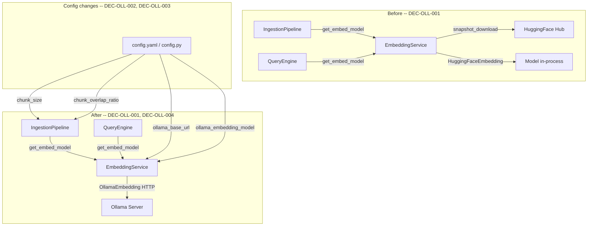

# ADR-OLL-001: Replace HuggingFaceEmbedding with OllamaEmbedding

## Status
Accepted

## Context
<!-- RQ-OLL-001, RQ-OLL-006 -->
Abyss uses `HuggingFaceEmbedding` (llama_index) combined with `snapshot_download`
(huggingface_hub) to load sentence-transformer models in-process. This means that on every cold
start of the MCP server, the embedding model must be located in a local cache or downloaded from
HuggingFace Hub and then loaded into memory. This introduces a startup latency of several seconds
to minutes depending on hardware and network conditions, which is a significant pain point for
end-users.

Additionally, storing model weights in the application repository (`data/models/`) couplesthe
deployment footprint of the application to the size of the ML model.

## Decision
<!-- DEC-OLL-001 -->
**DEC-OLL-001**: Replace `HuggingFaceEmbedding` with `OllamaEmbedding` from
`llama_index.embeddings.ollama`. Abyss will delegate all embedding computation to a locally
running Ollama server via HTTP. The application will no longer load or cache any ML model
in-process.

<!-- DEC-OLL-002 -->
**DEC-OLL-002**: Introduce two new explicit configuration parameters in `config.py` / `config.yaml`:
- `ollama_base_url` (default: `http://localhost:11434`) — the URL of the Ollama server.
- `ollama_embedding_model` (default: `nomic-embed-text`) — the Ollama model to use for embeddings.

Both parameters replace the former `embedding_model_name` and `embedding_cache_dir` parameters,
which are removed entirely.

<!-- DEC-OLL-003 -->
**DEC-OLL-003**: Replace the dynamic `_infer_chunk_params()` function (which read `max_seq_length`
from the HuggingFace model config JSON on disk) with two explicit configuration parameters:
- `chunk_size` (default: `512`) — number of characters per chunk.
- `chunk_overlap` (default: derived from `chunk_overlap_ratio` x `chunk_size`).

The `chunk_overlap_ratio` parameter is retained to keep the overlap as a fraction of chunk_size.
`_infer_chunk_params()` is removed.

<!-- DEC-OLL-004 -->
**DEC-OLL-004**: `EmbeddingService` is refactored to wrap `OllamaEmbedding` instead of
`HuggingFaceEmbedding`. All HuggingFace-specific methods (`_ensure_snapshot`,
`get_max_seq_length`) are removed. The singleton pattern and public `get_embed_model()` API
are preserved so that `IngestionPipeline` and `QueryEngine` require no structural changes.

## Consequences
- **Easier**: Cold startup is near-instant for the embedding subsystem; no in-process model load.
- **Easier**: The `data/models/` directory and all cached weights are no longer needed.
- **Easier**: Removes `huggingface_hub` and `llama_index.embeddings.huggingface` from the
  dependency set, reducing install size and eliminating a heavyweight dependency.
- **Constrained**: The user must have Ollama installed and the desired embedding model pulled
  (`ollama pull nomic-embed-text`) before using Abyss.
- **Constrained**: Chunk size is no longer automatically adapted to the model's
  `max_seq_length`; the user is responsible for keeping `chunk_size` consistent with the
  chosen Ollama model's context window.
- **Harder**: Multi-host or container deployments must ensure the Ollama server is reachable
  at the configured URL.

## Alternatives Considered

### Keep HuggingFaceEmbedding, load lazily
Rejected. Lazy loading still incurs the full startup penalty on the first actual embedding call
(first index or query), which happens in the hot path. The user experience degradation is the same.

### SentenceTransformers direct (no llama_index)
Rejected. Replaces one in-process model load with another; does not solve the root cause.

### Remote HuggingFace Inference API
Rejected. Requires an internet connection and API key; unsuitable for an offline-first local
RAG server.

### OpenAI-compatible embedding endpoint (e.g., llama.cpp server)
Not chosen for this ADR. Ollama is the preferred local server for this project. The
`llama_index.embeddings.ollama.OllamaEmbedding` integration is mature, maintained, and
mirrors the existing llama_index API surface already used by Abyss.

## Diagram

